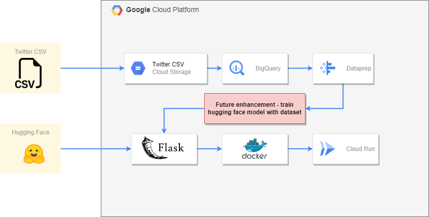
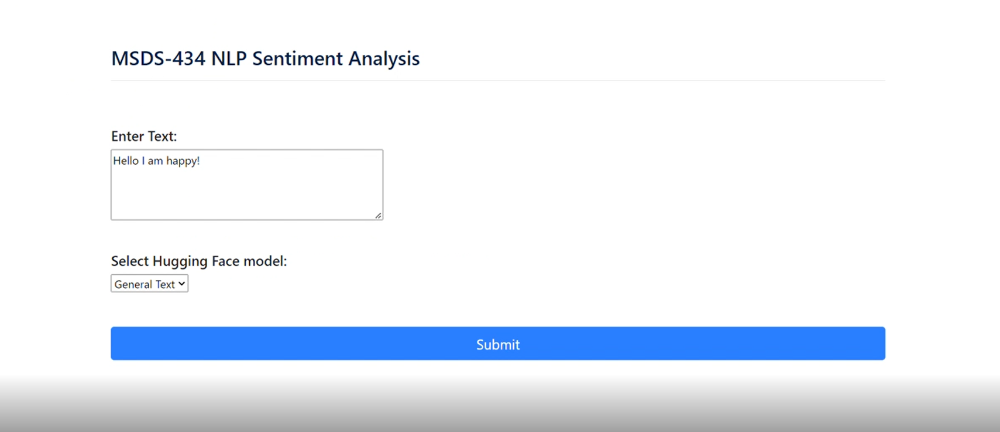
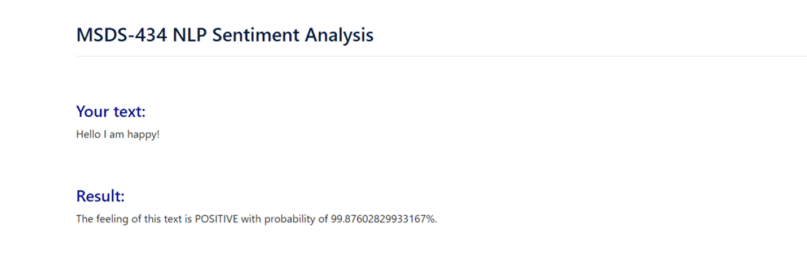

# MSDS434-Project

## Architecture Diagram

## Summary

This projects captures the deployment of a pretrained hugging face model using GCP's Cloud Run. Intial iteration utilized Google App Engine, but limitations on this service made Cloud Run more suitable for deployment. Future enhancements could involve training the pretrained models using a new data dataset. 

The following GCP services were used:

Cloud Run -- used to deploy containarized applications

Cloud Storage-- durable low cost storage for data accesses infrequently

BigQuery-- serveless multicloud data warehouse

Dataprep -- cloud dataprep services

## Website Demo

### Prediction

